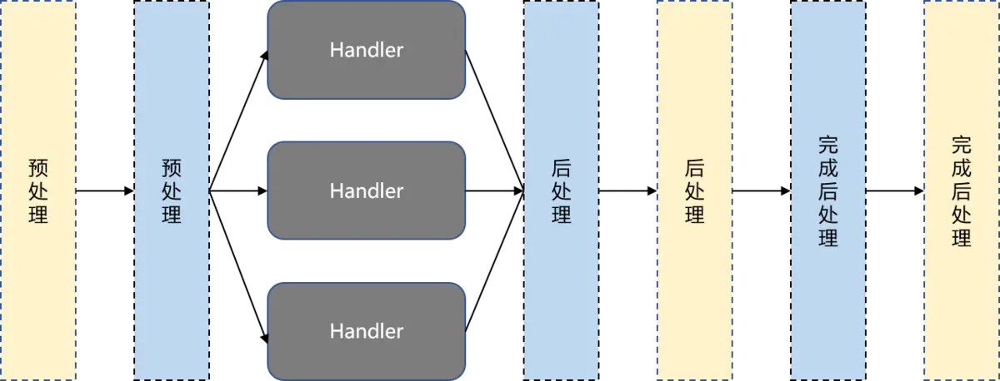

# HandlerInterceptor

## 基本概念

其中一种AOP编程方式，编程接口有

1. preHandle 在HandlerAdaptor处理Handler前，处理request、response。
2. postHandle 在处理Handler后，DispatcherServlet渲染视图之前，处理request，而response已经由HandlerAdaptor提交，无法修改response。修改response的场景可由ResponseBodyAdvise接口完成。
3. afterComplete 请求处理完成之后调用，适合做一些资源清理工作。

## 集成工作

1. 自定义HandlerAdaptor实现
2. 注册自定义HandlerAdaptor

Spring boot可通过`@Configuration`、`@EnableWebMvc`的WebMvcConfigurer实现接口，复写addInterceptors方法注册,

## 拦截器工作细节

1. 执行顺序，与filter通过order属性标记执行顺序不同，Intercepter的执行顺序与注册顺序保持一致。

## 异步HandlerInterceptor

AsyncHandlerInterceptor是HandlerInterceptor的子接口，可在异步请求处理后调用。当Handler启动处理一个异步请求时，DispatcherServlet退出之前不会调用postHandle和afterCompletion两个方法（同步请求DispatcherServlet退出前会调用），因为可能尚未准备好请求处理的结果，并且有可能结果在另外一个线程中产生。在这种场景，DispatcherServlet将改为调用afterConcurrentHandlingStarted方法，以支持实现在释放线程之前清理与线程相关的资源等类似的任务。

[HandlerInterceptor](https://www.jianshu.com/p/a7f5707b72a4)
