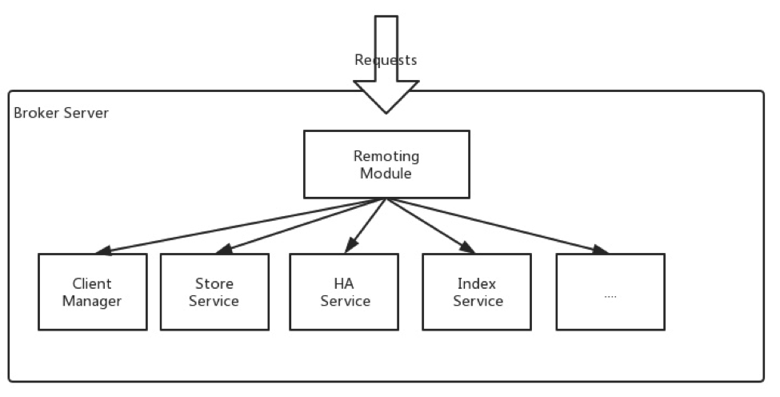

# RocketMQ Architecture

## 概述

### NameServer

轻量级的服务发现和路由，每个NameServer都会记录所有的路由信息，提供相应的读写服务，支持快速扩容。

- Broker Management，接受Broker的注册消息，并提供心跳机制检测一个Broker是否还存活
- Routing Management，存储所有的路由信息，为客户端的查询，存储队列信息

### Broker Cluster

Broker透过轻量级的TOPIC和QUEUE机制来服务消息的存储。支持Pull和Push模式，包含容错机制，并能够提供强大的峰值填充能力，能够按照消息的原始顺序累积消息。
同时Broker提供许多传统消息系统都缺少的一些机制，比如灾备、丰富的统计指数和告警机制。

有多个子模块共同组成

- Remoting Module， Broker的入口，处理客户端的请求
- Client Manager，管理客户端(producer/consumer)，维护consumer对topic的订阅
- Store Service，提供简单的API存储或读取保存在物理盘上的消息
- HA Service，在主Broker和从Broker间，提供数据同步特性
- Index Service，为消息特殊的key建立索引，提供消息的快速查询

### Producer Cluster

### Consumer Cluster