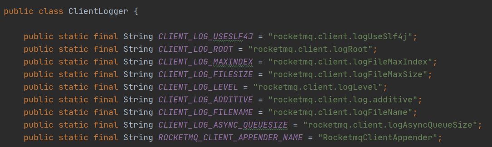

# rocketmq client log

如下图，可以看到rocket mq client log的一些配置信息，相应的改变引用client jar的应用启动参数即可调整log的行为

如果我们想调整日志的实现可以使用如下启动参数

`-Drocketmq.client.logUseSlf4j=true`

如果我们想调整日志的存放位置，可以使用如下启动参数

`-Drocketmq.client.logRoot=logs/rocketmq-log`
